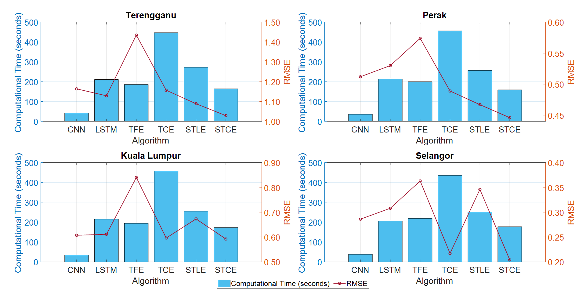

# Wholesale Price Forecasting Pipelines

This repository contains multiple time‑series forecasting pipelines for daily wholesale price data, using various deep‑learning architectures:

- **STCE**: Transformer + CNN + Remove Positional Encoding 
- **TCE**: Transformer + CNN + Positional Encoding + MLP  
- **STLE**: Transformer + LSTM  
- **TFE**: Transformer + Feed‑Forward (FFN)  
- **LSTM**: Classic LSTM  
- **CNN**: 1D‑Convolutional network  

Each pipeline reads one or more `*_FillKNN.xlsx` files (raw, KNN‑filled datasets) from `data/raw/`, trains a model, and writes prediction results (actual vs. predicted, plus RMSE/MAE/MAPE metrics) into per‑crop Excel workbooks under `outputs/`.

---

## 📈 Outputs

Each generated Excel workbook (`<Crop>_<Pipeline>_results.xlsx`) contains one sheet per input sheet, with columns:

- **Actual**: true wholesale prices  
- **Predicted**: model’s forecasts  
- **RMSE**, **MAE**, **MAPE**: evaluation metrics  

## 📊 Example Results

Here’s how our STCE model’s Comparison of time consume and RMSE with all the models looks:

## 🔗 References
-  J. Li et al., *‘‘Fast and accurate gas turbine emission prediction based on a light and enhanced Transformer model* (2024)
- Vaswani et al., *Attention Is All You Need* (2017)  

---

Feel free to open an issue or submit a PR if you need help extending these pipelines to new crops or architectures!
## 📑 Research Paper

You can read the full paper on ResearchGate:

[

Or click here:

🔗 [Go to my paper on ResearchGate](https://www.researchgate.net/publication/391554667_Computationally_Efficient_Single_Layer_Transformer_Convolutional_Encoder_for_Accurate_Price_Prediction_of_Agriculture_Commodities)
